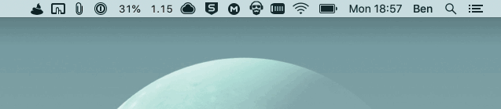

# Sendshit App

[](https://github.com/shitty-inc/sendshit-app/releases)

This is a MacOS app that lets you send encrypted files and screenshots via the [sendsh.it](https://github.com/shitty-inc/sendsh.it) file transfer service from the menu bar.

## Installation

Download the latest `.dmg` file from the [releases](https://github.com/shitty-inc/sendshit-app/releases) page.

## Usage



## Building

```bash
$ go build -o build/SendShit.App/Contents/MacOS/sendshit-app
```
